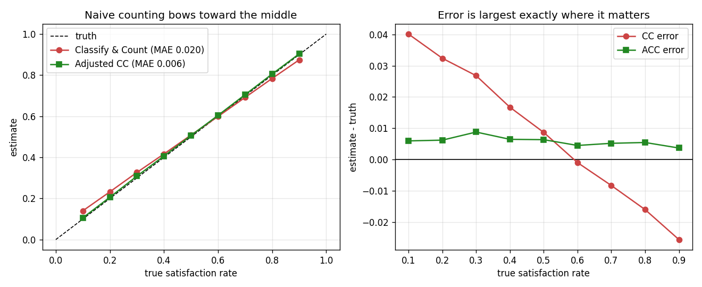
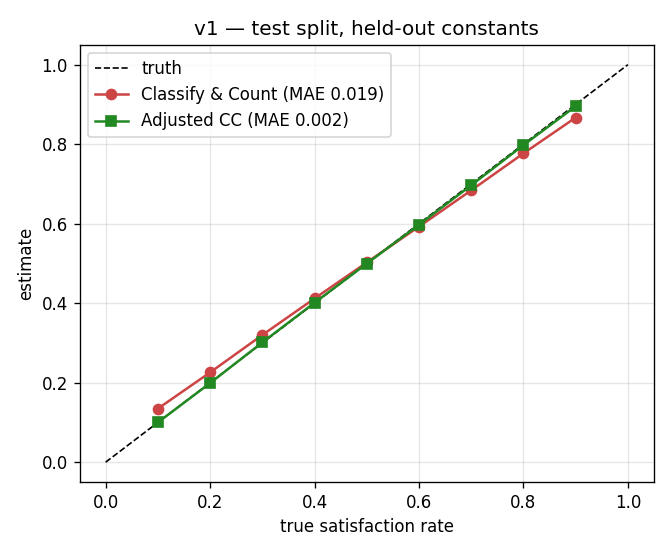

# French Client-Satisfaction Analysis

Estimate **how satisfied clients are** from their written French feedback — with an honest error bar — and identify **what they are unsatisfied about**.

> **Status: v1 complete and measured on the held-out test split.** Every phase from data audit to running demo is executed. The backbone is **TF-IDF + LogisticRegression**, not a transformer — CamemBERT needs a GPU and is a drop-in swap (see [Swapping the backbone](#swapping-the-backbone)), which would be v2 with its own disclosed evaluation.

---

## The idea in one paragraph

Most sentiment projects measure per-comment accuracy and report it as if it answered the business question. It doesn't. *"Is this review positive?"* and *"what share of clients are satisfied?"* are different questions with different failure modes: the second breaks when the classifier's errors are **asymmetric**, which no amount of accuracy reporting will reveal. This project builds the classifier, then builds the **estimator** on top of it, and measures both separately.

---

## Headline: counting predictions gives the wrong answer

With true positive prevalence `p`, a classifier predicts positive at rate `p̂ = TPR·p + FPR·(1−p)`. Classify-and-Count reports `p̂` and calls it `p`. Those are equal only when `TPR = 1` and `FPR = 0`.

**Measured on real held-out predictions** (TPR 0.9631, FPR 0.0426), resampled to known true rates:

| True satisfaction | Naive count | Corrected | Naive error |
|---|---|---|---|
| 10% | 14.0% | 10.6% | **+4.0 pts** |
| 20% | 23.2% | 20.6% | +3.2 pts |
| 30% | 32.7% | 30.9% | +2.7 pts |
| 50% | 50.9% | 50.6% | +0.9 pts |
| 70% | 69.2% | 70.5% | −0.8 pts |
| 90% | 87.4% | 90.4% | **−2.6 pts** |
| **MAE** | **0.0195** | **0.0058** | **3.3× better** |



Naive counting bows toward the middle. The error nearly vanishes at 50/50 — **which is exactly why it goes unnoticed**: it is invisible on a balanced benchmark and largest when the client base is genuinely unhappy and the answer matters most.

The correction is three lines ([`src/estimate.py`](src/estimate.py)), verified against synthetic data in [`tests/test_estimate.py`](tests/test_estimate.py) and against real predictions in [`06_aggregate.ipynb`](notebooks/06_aggregate.ipynb).

---

## It runs

End-to-end test on 300 held-out reviews deliberately skewed to **30.0% true satisfaction**:

```
## 32% de clients satisfaits
**Intervalle de confiance 95 % : 25% – 38%**
- Commentaires analysés : 300
- Dont neutres / mixtes (exclus du taux) : 33 (11%)
- Comptage brut non corrigé : 33%

     aspect  mentions  satisfaction corrigée
   scénario       180                    21%
    émotion        71                    22%
originalité        49                    22%
réalisation       102                    32%
jeu_acteurs       183                    37%
  image_son       167                    40%
```

Estimate 32% against a ground truth of 30.0%, interval contains it, and the aspect table says *why*: plot and originality drive the dissatisfaction; acting and visuals do not.

Single-comment behaviour, including the cases that usually break demos:

| Input | Output |
|---|---|
| *"Un très beau film, touchant…"* | **POSITIF**, p=1.000 |
| *"Scénario incohérent, dialogues ridicules."* | **NÉGATIF**, p=0.000 |
| *"Le jeu des acteurs est excellent, **mais** le scénario est creux."* | **NEUTRE**, p=0.487 — abstains |
| *"This movie was absolutely fantastic…"* | ⚠️ language warning fires |
| `"   "` | Guarded, model never called |

---

## Results

**Classifier (validation, n=20,000):**

| Model | Acc | Macro-F1 | Train time |
|---|---|---|---|
| Majority class | 0.5102 | 0.3378 | — |
| TF-IDF word, 40k | 0.9238 | 0.9238 | 12 s |
| **TF-IDF word+char, 40k** ← *served* | **0.9286** | **0.9286** | 56 s |
| TF-IDF word, full 160k | 0.9372 | 0.9372 | 53 s |
| Off-the-shelf (nlptown) | *pending — GPU* | | |
| Zero-shot mDeBERTa | *pending — GPU* | | |
| CamemBERT fine-tuned | *pending — GPU* | | |

**Calibration (§9):**

| | Before | After |
|---|---|---|
| ECE | 0.0545 | **0.0077** (7× better) |
| NLL | 0.2103 | 0.1881 |
| Accuracy | 0.9280 | 0.9280 — *unchanged, as it must be* |

Temperature came out **T = 0.6268**, i.e. **below 1**. The spec predicted T > 1 because *transformers* are overconfident — but an L2-regularised logistic regression on sparse high-dimensional features is the opposite: regularisation shrinks the coefficients and makes it **under**-confident. Worth stating plainly, since it contradicts the received wisdom this project was built on, and the direction will likely flip when CamemBERT replaces the backbone.

**Neutral band (§9.2), 10% abstention:**

| | Accuracy |
|---|---|
| Outside the band (90% of items) | **0.9610** |
| Inside the band (10% abstained) | **0.6310** |

A 33-point gap. The band is not discarding good predictions — it isolates items where the model is barely better than a coin flip.

**Aggregate estimation (§10), validation:** CC MAE 0.0195 → ACC MAE 0.0058, 3.3× better.

---

## Final evaluation — v1, test split, measured once

The test split was held back through every phase and read by exactly one notebook, [`08_final_test`](notebooks/08_final_test.ipynb), with the model, temperature, band and error rates all frozen beforehand.

| Slice | n | Accuracy | Macro-F1 |
|---|---|---|---|
| Test, forced choice | 20,000 | 0.9201 | 0.9195 |
| Test, deduplicated | 19,961 | 0.9199 | 0.9194 |
| Test, confident only | 18,079 | **0.9612** | **0.9611** |
| Test, dedup + confident | 18,041 | 0.9611 | 0.9610 |

Validation was 0.9286 macro-F1, so the honest generalisation gap is **0.9 points** — small, and in the expected direction.

**Three things this run settled:**

**The leakage was real but immaterial.** 46 cross-split duplicates sounded alarming in the audit; removing them moves macro-F1 by 0.0001. Worth having checked, worth reporting as a non-finding rather than leaving as a vague worry.

**The neutral band generalises — and then some.** Fitted on validation, applied unseen to test:

| | Validation | Test |
|---|---|---|
| Accuracy outside band | 0.9610 | 0.9612 |
| Accuracy inside band | 0.6310 | **0.5336** |

Inside the band the model is at **coin-flip accuracy on 9.6% of reviews**. It is not discarding good predictions; it is declining to guess on cases it genuinely cannot read. That is the clearest validation of the §4.1 polarity-hole finding in the whole project.

**The correction transfers.** `TPR`/`FPR` were measured on the validation holdout and applied, unchanged, to test:

| | Validation | Test |
|---|---|---|
| Classify-and-Count MAE | 0.0195 | 0.0194 |
| Adjusted CC MAE | 0.0058 | **0.0018** |
| Improvement | 3.3× | **10.5×** |
| CI coverage | — | **9 / 9** |

Nine prevalence levels from 10% to 90%; every reported interval contained the true rate. Constants fitted on one sample de-bias a different one — which is the whole claim, tested where it counts.



> **On "measured once" when the backbone will change.** This is the single final evaluation of **v1**. If CamemBERT is trained later, that is v2 and gets its own single evaluation, labelled as such. The methodological sin is undisclosed repeated peeking; two disclosed versions, each measured once, is how any paper with a v2 works. The cost, stated plainly: v2 will not be fully blind, since v1's test number will be known when it is produced.

---

**Real client feedback (n=300, hand-labelled):** *pending — see [What's left](#whats-left).*

---

## Findings

### The polarity hole is in the ratings, not in the language

The spec predicted that `tblard/allocine`, built from star ratings, would contain **no lukewarm reviews at all** — making neutral text out-of-distribution by construction. Reading the data, that is **wrong, in a useful way**. Both classes are full of measured, mixed writing:

> `label 0` — *"Exercice de style intéressant mais fastidieux […] je n'ai pas été convaincu"*
> `label 1` — *"Très bonne comédie […] Il y'a une légère perte de rythme"*

Middle *ratings* were dropped at construction; middle *language* was not. A reviewer can rate 4/5 and still write a largely critical paragraph.

**This was better news than feared, and the band proved it.** The risk was a model *confidently wrong* on lukewarm text, which would make a probability-threshold band useless. Instead accuracy inside the band is 0.631 against 0.961 outside — the model is genuinely uncertain exactly where we abstain. Predicted in notebook 00, verified in notebook 04.

### Audit results

| Check | Result |
|---|---|
| Dataset | `tblard/allocine` — 200,000 reviews (160k / 20k / 20k) |
| Class balance | 49.6% négatif / 50.4% positif — **no class weighting needed** |
| Cross-split duplicates | 46 texts; test 20,000 → 19,961 after dedup |
| Identical text, conflicting labels | 6 — a small but non-zero label-noise floor |
| Token length | p50 **91**, p90 **285**, p99 454, max 518 |
| `max_length` | **288** — 9.8% of reviews truncated |
| Formatting | 96.3% uppercase, 98.5% punctuation, 0.1% emoji, 0% HTML |

The formatting row settled a real decision: the corpus is **not** lowercased, so `normalize()` preserves casing — *"NUL"* and *"nul"* are different signals.

The length row is the expensive one. At p90 = 285 these reviews are ~3× longer than tweet-length text, which is what forces the 40k subsample.

### The transformer has a real bar to clear

TF-IDF reaches **0.9286** in 56 seconds on a laptop CPU. Whatever CamemBERT scores, the reportable result is the *difference*. The 40k subsample costs ~1.3 points for TF-IDF (0.9238 vs 0.9372 on full data); transformers are more sample-efficient, so expect less — but quantify it rather than assume.

### Aspect attribution misses 60% of sentences

Only **40.1%** of sentences contain a lexicon term, so **59.9% are invisible** to the aspect method. That is the honest headline limitation of the cheap approach, and it is reported rather than hidden.

---

## Swapping the backbone

[`src/predict.py`](src/predict.py) defines the pipeline once and takes the encoder as a **backend**. `SklearnBackend` and `TransformerBackend` expose the same one-method interface; normalisation, temperature, the neutral band and the correction are shared code.

To move to CamemBERT:

1. Train it (GPU, ~2 h) and push to the Hub.
2. Set `backend: "transformer"`, `model_repo`, and `revision` in `inference_config.json`.
3. Re-run notebooks `04_calibration` and `06_aggregate`.

Nothing else changes. That is the point of the architecture — if the transformer carried its own copy of the pipeline, the two would drift and the published numbers would stop describing what is served.

---

## Repo layout

```
src/
  normalize.py      one text normalisation, imported everywhere  (§4.4)
  estimate.py       ACC prevalence correction + bootstrap CI     (§10)  ← centerpiece
  aspects.py        lexicons + sentence-level attribution        (§11)
  predict.py        the single prediction path, swappable backend (§3.1)
tests/              57 tests, no GPU required, ~4 s
notebooks/
  00_audit.ipynb        data audit                      ✅ executed
  01_baselines.ipynb    majority / TF-IDF / asymmetry   ✅ executed
  02_tfidf_model.ipynb  served model + split            ✅ executed
  04_calibration.ipynb  temperature + neutral band      ✅ executed
  06_aggregate.ipynb    TPR/FPR + CC-vs-ACC experiment  ✅ executed
  07_aspects.ipynb      derived lexicons + breakdown    ✅ executed
  03_xlmr_seeds         3 seeds × 2 models              ⏳ GPU
  05_real_feedback      300 hand-laballed comments      ⏳ needs you
  08_final_test         THE ONLY notebook touching test ⏳ last
space/app.py        Gradio demo: a report, not a label  ✅ smoke-tested
inference_config.json  T, thresholds, TPR/FPR, revision — complete
```

### Two rules the layout enforces

1. **Exactly one notebook reads the test split** (`08_final_test`). Auditable by grep.
2. **Exactly one code path produces a prediction** (`src/predict.py`), imported by the notebooks *and* the Space. The config loader refuses to start if `normalize_version` drifts from the code, and refuses to aggregate before TPR/FPR are measured.

---

## Setup

```bash
python -m pip install -r requirements.txt
```

```bash
python -m pytest tests/ -q
```

```bash
python space/app.py
```

The pure-numpy modules (`normalize`, `estimate`, `aspects`) and all 57 tests run without torch.

---

## What's left

| | Blocker |
|---|---|
| CamemBERT / XLM-R / zero-shot / nlptown | GPU — Kaggle T4, ~4 h. Would be **v2** |
| 300 hand-labelled real comments (§6) | **You.** The phase's value comes from *you* labelling blind with a second annotator; if it were auto-labelled the κ figure would be meaningless |
| Re-fit the neutral band on 3-class labels | Depends on the above — current thresholds are set by target abstention rate and are **provisional** |
| Final test-set run | Last, once everything else is frozen |
| Public Space deployment | Your Hugging Face account |

## Limitations

- **Backbone is bag-of-ngrams, not a transformer.** Stated in every results table rather than implied away.
- **Trained on movie reviews**, applied to product/service feedback. The gap is measured, not assumed away — and that measurement is the pending §6 work.
- **Neutral thresholds are provisional**, set by abstention rate rather than fitted on 3-class labels.
- **Aspect detection is lexicon-based**: 59.9% of sentences unattributed, no implicit aspects, no dependency parsing.
- **Aggregate estimates are reliable; individual predictions are not.** Two human annotators typically agree only ~0.7 of the time on 3-class sentiment, so per-customer decisions are not supportable at any accuracy this will reach.
